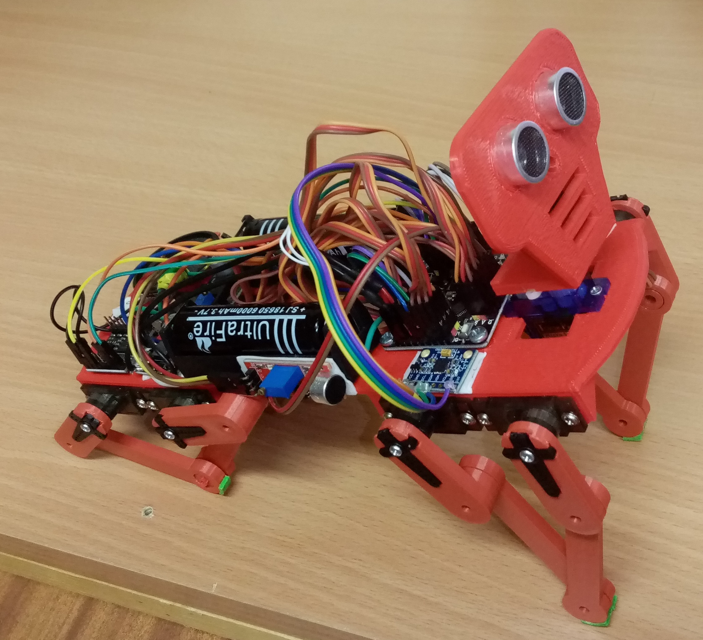

# kocur-v-cizmach
Cat-like arduino robot with 4 legs

list of parts:

mechanical:

* 4 legs - each made of 4 different pieces
* main body
* head
* screws for fixing arduino, power supply, and battery holders

electronic:

* 2x plastic holder for 16500 LiIon batteries
* 2x 16500 LiIon batteries
* 8x mg90s servo + 1x sg90 or mg90 for head
* arduino nano strong
* lm2596 tuned to 5V
* HC-SR04 ultrasonic sensor
* passive buzzer
* KCD-11 power switch
* cables
* resistor divider (i.e. 5.5K + 56K) to measure bat. voltage

optional:

* HC-05 compatible BT module
* extra 5V4A power supply to avoid spurious resets
* DfPlayer Mini and 2W 8Ohm speaker
* analog microphone
* mpu6050 gyro/accelerometer
* capacitance touch sensor

Pin connections:

    D0   reserved for programming/serial comm on USB 
    D1   reserved for programming/serial comm on USB 
    D2   BT Tx (i.e. our Rx, signal from BT to Arduino)
    D3   Right back 2 (RB2)
    D4   BT Rx (i.e. our Tx, signal from Arduino to BT)
    D5   Right back 1 (RB1)
    D6   Right front 2 (RF2)
    D7   Right front 1 (RF1)
    D8   Left front 2 (LF2)
    D9   Left front 1 (LF1)
    D10  Left back 1 (LB1)
    D11  Left back 2 (LB2)
    D12  Head
    D13  Buzzer
    A0   US Trig
    A1   US Echo
    A2   DfPlayer Mini Rx
    A3   voltage divider on batteries
    A4   SDA of MPU6050
    A5   SCL of MPU6050
    A6   Touch sensor
    A7   Microphone

Building instructions: https://kempelen.dai.fmph.uniba.sk/files/kocur-v-cizmach-manual/

Choreographies are sequences of motor angles 0-179 8-tuples in this order: (delay is in ms and is applied 100-times per each move, typical values 1-10, e.g. 1 => the movement is spread over 100 steps, each lasting 1ms, in total about 100 ms. To change that parameter, edit play_step() function)

    LF1 LB1 RF1 RB1 LF2 LB2 RF2 RB2 delay

In edit mode, use the following keys to move all degrees of freedom:

   (-> means forward, <- means backward, servo 1 is front, servo 2 back)

    1  LF1 -> -      2  LB1 -> -      3  RF1 -> +      4  RB1 -> +
    q  LF1 <- +      w  LB1 <- +      e  RF1 <- -      r  RB1 <- -
    a  LF2 <- +      s  LB2 -> -      d  RF2 <- -      f  RB2 -> +
    z  LF2 -> -      x  LB2 <- +      c  RF2 -> +      v  RB2 <- -

https://www.youtube.com/watch?v=T9AiIFP-OWI

https://youtu.be/DKM0F1i9IDY

Software:

Arduino program allows to work with "choreographies": create, edit, test and debug, import, export, store into EEPROM, setup autoplay, and control the attached gadgets over the cable or Bluetooth module. Each of the three modes has interactive control and 'h' shows help - list of available commands:

    MoKraRoSA. Press H for help
    Control mode. Hit E for edit mode.
     1: forward
     2: backward
     3: right
     4: left
     5: down
     6: sit
     7: look around
    Play the sequence: /
    Repetitive play: \
    Play eeprom seq: t g b
    Initial position: *
    Position 90: 9
    Ultrasonic ON/OFF: u
    Battery level (*100 V): B
    Play melody: . , ; ' [ ]
    Stop melody: ESC/:
    Play/change music: m j n
    Music volume on/off: M
    Change music volume: < >
    Print help: h
    ---------------------    
    Edit mode. Hit C for control mode.
    Servo control:
    1 ... q
    2 ... w
    e ... 3
    r ... 4
    z ... a
    s ... x
    d ... c
    v ... f
    Step size control:
    - ... +
    Store next point: ENTER/W
    Print the sequence: SPACE/N
    Load (paste in) the sequence: L
    Save to EEPROM: E
    Load from EEPROM: O
    Toggle autostart: A
    Erase sequence: R
    Undo to last saved position: U
    Enter debug mode: TAB/T
    (to insert a break, repeat the same position again with delay)
    Play the sequence: /
    Repetitive play: \
    Play eeprom seq: t g b
    Initial position: *
    Position 90: 9
    Ultrasonic ON/OFF: u
    Battery level (*100 V): B
    Play melody: . , ; ' [ ]
    Stop melody: ESC/:
    Play/change music: m j n
    Music volume on/off: M
    Change music volume: < >
    Print help: h
    ---------------------    
    Debug mode:
     TAB/T   - leave debug mode
     SPACE/N - move to next step
     ENTER/W - replace with current
     ESC/:   - restore current step
     D       - delete current step
     ESC/:   - insert step before current
    Servo control:
    1 ... q
    2 ... w
    e ... 3
    r ... 4
    z ... a
    s ... x
    d ... c
    v ... f
    Step size control:
    - ... +
    Print help: h

Warning:

The LiIon batteries are sensitive to a complete discharge, therefore
the battery voltage is permanently measured using a voltage-divider
against the built-in 1.1V power regulator, and when they reach
a critical level, all functionality stops and an alarm is played
using the passive buzzer. It is recommended to recharge batteries
after the use, and store them for longer term charged to about a half
of their capacity.

Links:

*  Original project that inspired us: Baby “MIT Cheetah” opensource and 3D-printable robot by Marco (https://www.personalrobots.biz/baby-mit-cheetah-opensource-and-3d-printable-robot/)
* Our modifications in TinkerCAD (they may change): body and head (https://www.tinkercad.com/things/c9znID17vLj-cheetah-telo), legs (https://www.tinkercad.com/things/6ybUZ9S300i-cheetah-noha)
* Student project summer 2021: https://dai.fmph.uniba.sk/courses/dtv/index.php/Cheetah
* Student project winter 2021: https://wiki.robotika.sk/robowiki/index.php?title=Kocur_v_Cizmach_-_Alja%C5%BE_Andol%C5%A1ek_and_Ursek_Slivsek

contact: Pavel, pavel.petrovic at uniba.sk

